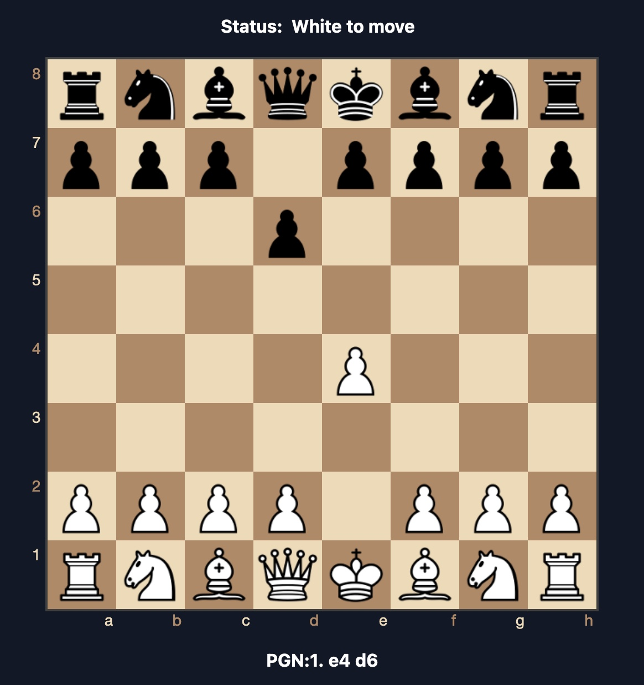

# Online Chess 

A Node.js application for playing chess online with real-time communication using WebSocket and styled with Tailwind CSS.




## Features

- Real-time multiplayer chess using WebSocket.
- Modern, responsive UI designed with Tailwind CSS.
- Lightweight and scalable architecture.
- Support for basic chess rules.

## Prerequisites

- [Node.js](https://nodejs.org/) (v14 or later)
- [npm](https://www.npmjs.com/) (comes with Node.js)

## Installation

1. Clone the repository:
   ```bash
   git clone <repository_url>
   cd online-chess
   ```

2. Install dependencies:
   ```bash
   npm install
   ```

3. Create a `.env` file in the root directory with the following environment variables:
   ```env
   PORT=3000
   ```

4. Start the application:
   ```bash
   npm start
   ```

5. Open your browser and navigate to `http://localhost:3000`.

## Usage

### Real-Time Chess
- Start a game by inviting another player.
- Moves are synced in real-time using WebSocket.

### Styling with Tailwind CSS
- Customize the UI using the `tailwind.config.js` file.
- Run the following command to generate Tailwind CSS:
  ```bash
  npx tailwindcss -i ./src/input.css -o ./public/output.css --watch
  ```
		
## Technologies Used

- **Node.js**: Backend framework.
- **WebSocket**: Real-time communication.
- **Tailwind CSS**: For styling the UI.
- **Express.js**: HTTP server framework.

## License

This project is licensed under the MIT License.
